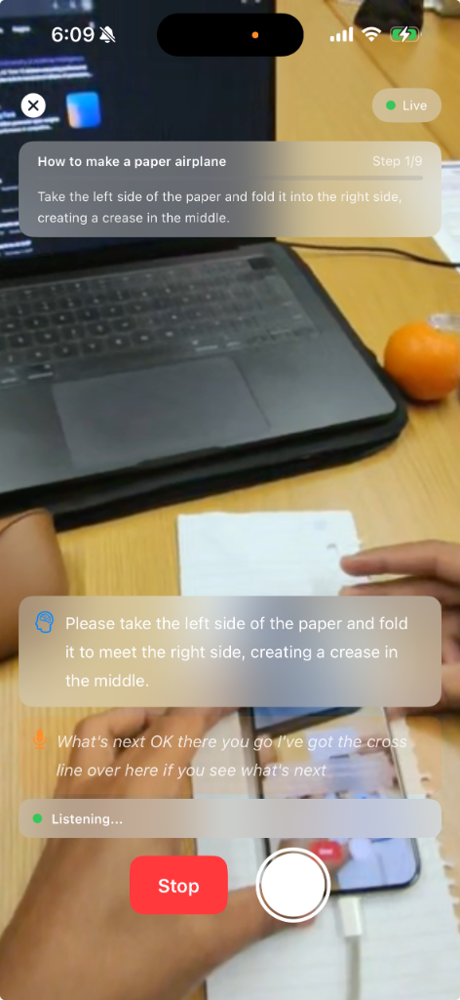

# Shadow: AI-Guided AR Coaching 🕶️🎓

**Shadow** is a next-generation education platform built for **PrincetonHacks 2024**. It transforms how practical, hands-on skills are taught by digitizing expert knowledge into a proactive, real-time AR coaching experience.

---

## 🌟 The Vision: Democratizing Expert Mentorship
Learning a physical skill—whether it's building a complex circuit, performing surgery, or even making the perfect pour-over coffee—has traditionally required a physical mentor standing over your shoulder. Videos are passive, and manuals are clunky.

**Shadow** changes the sphere of education by:
- **Scaling Expertise:** We use Google’s **Gemini 2.5 Flash** to analyze a single recording of an expert performed once, and we extract a "Master Knowledge Blueprint." This blueprint encodes not just instructions, but *technique, tempo, and failure triggers*.
- **Proactive Coaching:** Unlike voice assistants that wait for you to ask a question, Shadow **watches your hands**. It proactively corrects your movements, warns you about upcoming mistakes, and guides you through the "feel" of a task.
- **First-Person Immersion:** By utilizing the **Brilliant Labs Frame** AR glasses, the learner’s hands remain free, and the coaching is overlaid directly in their field of vision.

---

## 🛠️ System Architecture

Shadow is split into a high-performance Python backend and a native iOS AR client.

### 1. The "Shadow Brain" (Backend)
- **Engine:** FastAPI (Python)
- **AI Core:** Google Gemini 2.5 Flash (Multimodal)
- **Expert Pipeline:** Analyzes `.mp4` recordings to generate segmented steps, visual landmarks, and common beginner failure points.
- **Live Verification:** Evaluates camera frames every 3 seconds to determine step completion and technique accuracy.
- **Conversational Coach:** A creative, non-robotic voice agent that uses the Expert Blueprint to answer user questions contextually.

### 2. The AR Client (iOS)
- **Hardware Interface:** Native Swift integration with **MWDAT (Mobile Wearables Data Toolkit)** for Brilliant Labs Frame.
- **Unified Coaching UI:** A dynamic, color-coded bubble that blends Vision alerts (Silent Brain) and Voice coaching (Conversational Agent).
- **Audio Engine:** On-device Speech-to-Text (STT) combined with gTTS for high-fidelity vocal responses.
- **Smart Queueing:** Handles rapid user speech during AI processing to ensure a seamless, uninterrupted coaching flow.

---

## 📂 Project Structure

```text
├── Shadow/                 # Native iOS Application (SwiftUI)
│   ├── ViewModels/         # Logic for Vision, Voice, and Device sessions
│   ├── Views/              # AR Camera View, Unified UI, Expert Record flow
│   ├── Networking/         # ShadowAPIClient for real-time inference
│   └── Networking/         # Swift Models for the Knowledge Blueprint
├── backend/                # AI Inference Server (Python)
│   ├── agents/             # Gemini 2.5 Flash Agent Orchestration
│   │   ├── conversation_coach.py   # Conversational Logic & Skip Detection
│   │   └── voice_coach.py          # Blueprint Enrichment & Response Gen
│   ├── lessons/            # JSON-based Master Knowledge Blueprints
│   └── main.py             # FastAPI Routes & Multimodal Processing
└── meta-wearables-dat-ios  # Hardware Communication Layer
```

---

## 🚀 Impact on Education
Shadow bridges the gap between digital content and physical mastery. For the first time, an "expert" can be in a thousand places at once. By reducing the cognitive load of learning complex tasks, Shadow makes high-skill trades and hobbies accessible to anyone with a pair of glasses and the will to learn.

## 📱 App Interface & AI Analysis

<p align="center">
  
</p>

> **Left:** The "Vision Brain" identifies the user's hand position.  
> **Right:** The "Voice Coach" provides real-time conversational feedback and step guidance.

---

## ⚙️ Getting Started

### Backend Setup
1. `cd backend`
2. Create a `.env` file with `GOOGLE_API_KEY`.
3. `pip install -r requirements.txt`
4. `uvicorn main:app --host 0.0.0.0 --port 8000 --reload`

### iOS Setup
1. Open `Shadow.xcodeproj` in Xcode 15+.
2. Update `ShadowAPIClient.swift` with your Mac's local IP address.
3. Build and run on an iPhone connected to Brilliant Labs Frame glasses.

---

**Shadow — Learning through the lens of AI.**
*A PrincetonHacks 2024 Project*
