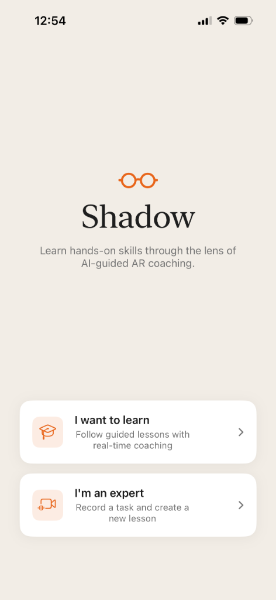
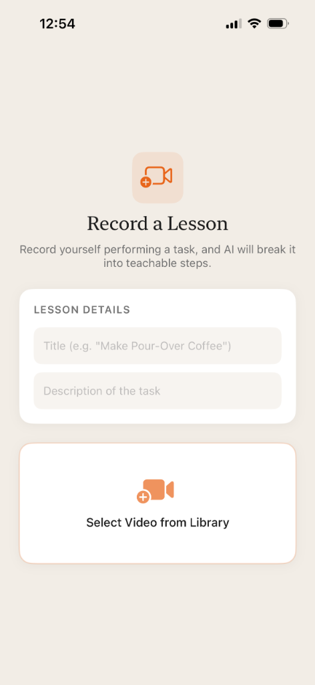
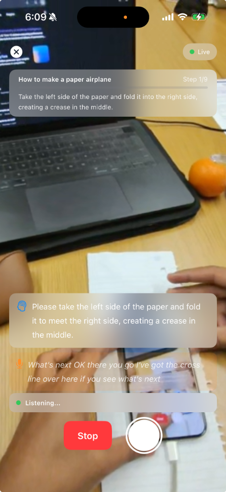

<div align="center">
  <h1>Shadow 🕶️</h1>
</div>

<div align="center">
  <h3>An expert watches over your shoulder — through your glasses — every time you learn a hands-on skill.</h3>
</div>

<div align="center">
  
  
  
  
  
</div>

<br>

<div align="center">
  
  
  
</div>

<div align="center">
  <sub><b>Left to right:</b> the learner/expert entry point · one-tap expert lesson capture · the real-time coaching brain in action</sub>
</div>

<br>

Shadow turns a single video of an expert performing a task into a live,
proactive AR coach. Record the expert once; Gemini distills their
technique, tempo, and failure patterns into a **Master Knowledge
Blueprint**. A learner then puts on Meta glasses, and Shadow watches their
hands through the camera — verifying each step, catching mistakes *before*
they happen, and answering questions out loud in a natural voice.

> [!NOTE]
> Videos are passive and manuals are clunky. The thing that actually works —
> a mentor standing over your shoulder — doesn't scale. Shadow is that
> mentor, digitized.

## Why Shadow?

- **The expert records once, teaches forever.** A single `.mp4` of the
  expert performing the task is enough. Gemini 2.5 Flash segments it into
  timestamped steps and extracts what videos can't teach: *tempo*
  ("a slow, steady, even pour"), *technique* ("circular motion, not a
  straight line"), and *failure triggers* ("filter leaning", "liquid over
  rim").
- **Proactive, not reactive.** Voice assistants wait for you to ask.
  Shadow watches. Camera frames from the glasses are verified against the
  blueprint every few seconds — it advances you when a step is visually
  complete and warns you the moment a known failure trigger appears.
- **Hands-free by design.** The learner's hands stay on the task. Coaching
  arrives as a color-coded overlay in their field of vision and as a voice
  in their ear — never a screen they have to look down at.
- **A coach, not a manual.** The voice agent ("Alex") is deliberately
  non-robotic: brief, warm, specific, occasionally funny. It hears what
  you actually said, sees what you're actually doing, and never recites
  the instructions back at you.

```
 EXPERT (once)                          LEARNER (every session)

 expert .mp4 ──► Gemini 2.5 Flash       glasses camera ──► /verify-step ──► Gemini 2.5 Flash
                     │                        │                                  │
                     ▼                        ▼                                  ▼
        Master Knowledge Blueprint      learner's voice ──► WebSocket ──► Gemini + gTTS
         (steps · tempo · technique          │                                  │
          landmarks · failure triggers)      ▼                                  ▼
                     │                  unified coaching bubble  ◄──  voice reply in ear
                     └──────────── grounds every response ──────────────────────┘
```

---

## System Architecture

Shadow is two halves: a Python "brain" that does all the seeing and
thinking, and a native iOS client that owns the glasses, the mic, and the
coaching UI.

### The Shadow Brain (`backend/`)

| Component | What it does |
|---|---|
| **Expert pipeline** (`POST /lessons/generate-steps`) | Uploads the expert `.mp4` to the Gemini File API, then prompts Gemini 2.5 Flash to segment it into the blueprint schema — schema-enforced JSON, low temperature. |
| **Silent vision loop** (`POST /sessions/{id}/verify-step`) | The core coaching loop. Receives a live camera frame every few seconds, compares it against the step's success criteria and failure triggers, returns `step_completed` + a coaching message. |
| **Conversational coach** (`POST /sessions/{id}/coach`) | Text-turn coaching grounded in the blueprint, with skip-detection (`advance_step`) when the learner says they're done. |
| **Voice session** (`WS /ws/sessions/{id}`) | Streams PCM audio chunks from the iPhone mic, transcribes and coaches in one Gemini pass, replies with gTTS audio. The iOS client pushes `context_update` messages so the voice agent always knows what the vision loop just saw. |
| **Lesson store** (`lessons/`) | Blueprints persisted as plain JSON — inspectable, editable, portable. |

### The AR Client (`Shadow/`)

- **Hardware layer** — native Swift integration with the
  **Meta Wearables Device Access Toolkit** (`meta-wearables-dat-ios`
  submodule) streams the first-person camera from Meta Glasses Gen 1.
- **Unified coaching UI** — one dynamic, color-coded bubble that merges
  the silent vision verdicts and the voice agent's replies, so the learner
  reads a single coaching channel instead of two competing feeds.
- **Audio engine** — on-device speech-to-text for wake-free listening,
  server-side gTTS for the coach's voice.
- **Smart queueing** — if the learner speaks while the AI is still
  thinking, the message is queued and flushed the instant the reply lands
  (`VoiceSessionManager.swift`), so conversation never deadlocks
  mid-task.
- **Expert flow** — record → auto-generate steps → review/edit
  (`ExpertRecordView`, `StepReviewView`) → publish as a lesson.

---

## Directory layout

```
Shadow-PrincetonHacks/
├── README.md                       this file
├── Shadow/                         native iOS app (SwiftUI)
│   ├── Views/                      Home, Expert Record, Step Review, live AR Stream
│   ├── ViewModels/                 vision loop, voice session, glasses device session
│   └── Networking/                 ShadowAPIClient + blueprint Swift models
├── Shadow.xcodeproj                Xcode project
├── backend/                        the Shadow Brain (Python)
│   ├── main.py                     FastAPI routes, vision loop, voice WebSocket
│   ├── agents/
│   │   ├── conversation_coach.py   "Alex" — conversational coaching + skip detection
│   │   └── voice_coach.py          audio transcription + coaching + gTTS in one pass
│   ├── lessons/                    Master Knowledge Blueprints (plain JSON)
│   └── requirements.txt
├── meta-wearables-dat-ios/         Meta Wearables Device Access Toolkit (submodule)
└── assets/                         README screenshots
```

## Getting started

### 1. Run the Shadow Brain

```bash
cd backend
pip install -r requirements.txt
echo "GOOGLE_API_KEY=<your key>" > .env
uvicorn main:app --host 0.0.0.0 --port 8000 --reload
```

`--host 0.0.0.0` matters — the iPhone reaches the backend over your local
network, not localhost.

### 2. Point the iOS app at your Mac

Open `Shadow.xcodeproj` in Xcode 15+, then set your Mac's local IP
(System Settings → Wi-Fi → Details) in
`Shadow/Networking/ShadowAPIClient.swift`:

```swift
enum ShadowAPI {
    static var baseURL = "http://<your-mac-ip>:8000"
}
```

### 3. Build and run

Build to an iPhone paired with Meta Glasses Gen 1 (the glasses stream
their camera through the Meta Wearables Device Access Toolkit). Both the
Mac and iPhone must be on the same Wi-Fi network.

> [!TIP]
> No glasses on hand? The expert-side flow (record → generate blueprint →
> review steps) runs entirely on the phone, and you can exercise the
> backend directly — `POST` an `.mp4` to `/lessons/generate-steps` and
> watch the blueprint come back.

## How a session works

**As an expert:** record yourself doing the task once. Shadow uploads the
video, Gemini segments it into steps with timestamps, tempo, technique
notes, visual landmarks, and failure triggers. You review and edit the
generated steps, then publish the lesson.

**As a learner:** pick a lesson and start. From there, three loops run
concurrently:

1. **The silent brain** — every few seconds, a frame from the glasses is
   verified against the current step. Completed? The UI advances and
   previews what's next. Failure trigger active? You get a specific,
   immediate correction.
2. **The voice coach** — speak at any time. Your audio streams over the
   WebSocket; Alex answers in your ear, grounded in both the blueprint
   *and* the latest thing the vision loop saw.
3. **The unified bubble** — both loops feed one color-coded overlay, so
   coaching reads as a single voice, not two systems talking over each
   other.

## Known gaps

- **Latency is network-bound.** Every vision verdict is a round trip to
  Gemini; on hackathon Wi-Fi that's a few seconds per check. On-device
  landmark tracking between cloud verdicts is the natural next step.
- **`baseURL` is hand-configured.** The client points at a hard-coded
  local IP; Bonjour discovery would remove the last manual setup step.
- **Blueprints trust the expert video.** One recording, one perspective —
  the pipeline doesn't yet merge multiple takes or camera angles into a
  single blueprint.
- **gTTS is a placeholder voice.** It's reliable and free, but a
  streaming neural TTS would cut the pause before Alex speaks.

## The bigger picture

For the first time, an expert can be in a thousand places at once.
Learning a physical skill — wiring a circuit, suturing, dialing in a
pour-over — has always required a mentor physically present. Shadow makes
that mentorship a file: recorded once, distilled by AI, and replayed as
live guidance for anyone with a pair of glasses and the will to learn.

---

<div align="center">
  <b>Shadow — learning through the lens of AI.</b><br>
  <sub>A PrincetonHacks project · Education Track</sub>
</div>
